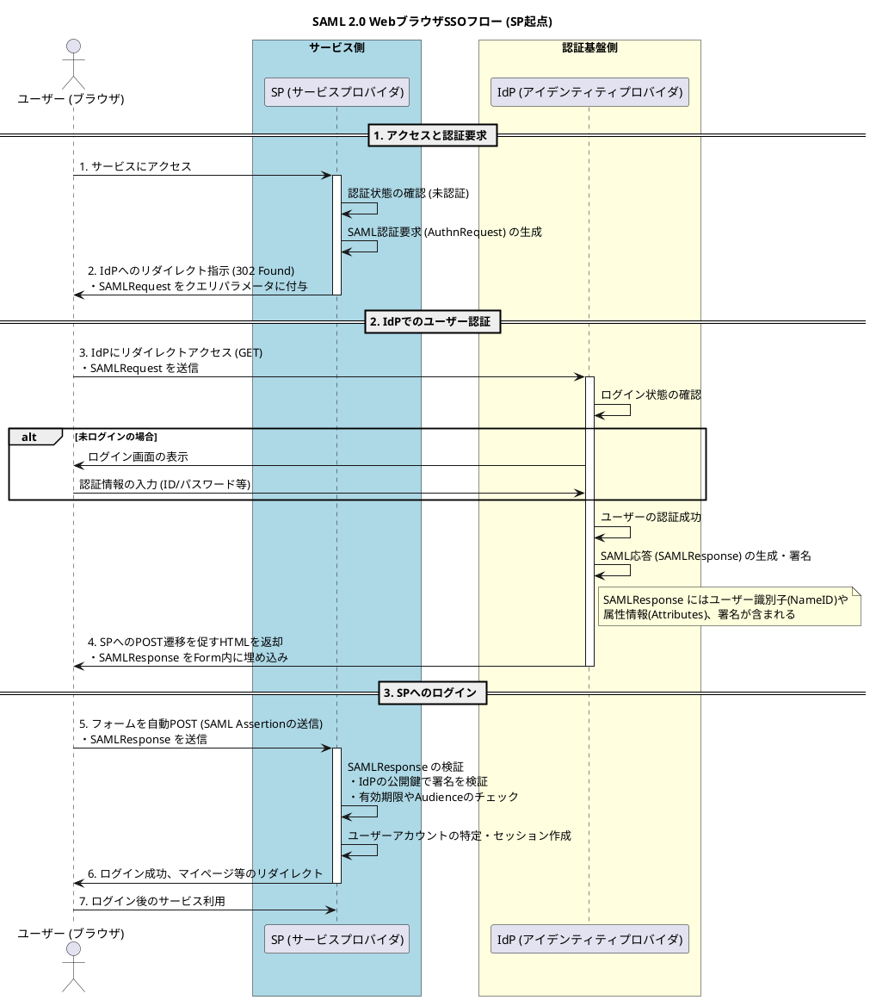
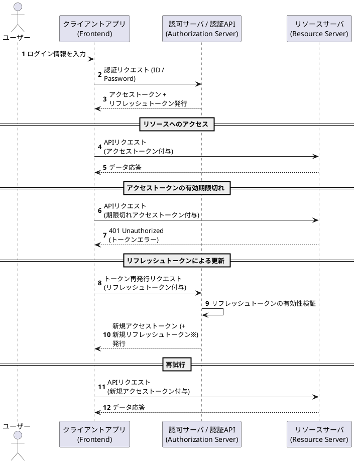

```plantuml
@startuml
skinparam BoxPadding 10
skinparam ParticipantPadding 10

title SAML 2.0 WebブラウザSSOフロー (SP起点)

actor "ユーザー (ブラウザ)" as User
box "サービス側" #LightBlue
    participant "SP (サービスプロバイダ)" as SP
end box
box "認証基盤側" #LightYellow
    participant "IdP (アイデンティティプロバイダ)" as IdP
end box

== 1. アクセスと認証要求 ==
User -> SP: 1. サービスにアクセス
activate SP

SP -> SP: 認証状態の確認 (未認証)
SP -> SP: SAML認証要求 (AuthnRequest) の生成

User <- SP: 2. IdPへのリダイレクト指示 (302 Found)\n・SAMLRequest をクエリパラメータに付与
deactivate SP

== 2. IdPでのユーザー認証 ==
User -> IdP: 3. IdPにリダイレクトアクセス (GET)\n・SAMLRequest を送信
activate IdP

IdP -> IdP: ログイン状態の確認
alt 未ログインの場合
    User <- IdP: ログイン画面の表示
    User -> IdP: 認証情報の入力 (ID/パスワード等)
end

IdP -> IdP: ユーザーの認証成功
IdP -> IdP: SAML応答 (SAMLResponse) の生成・署名
note right of IdP
  SAMLResponse にはユーザー識別子(NameID)や
  属性情報(Attributes)、署名が含まれる
end note

User <- IdP: 4. SPへのPOST遷移を促すHTMLを返却\n・SAMLResponse をForm内に埋め込み
deactivate IdP

== 3. SPへのログイン ==
User -> SP: 5. フォームを自動POST (SAML Assertionの送信)\n・SAMLResponse を送信
activate SP

SP -> SP: SAMLResponse の検証\n・IdPの公開鍵で署名を検証\n・有効期限やAudienceのチェック
SP -> SP: ユーザーアカウントの特定・セッション作成

User <- SP: 6. ログイン成功、マイページ等のリダイレクト
deactivate SP

User -> SP: 7. ログイン後のサービス利用

@enduml
```

```plantuml
@startuml
autonumber
skinparam maxmessagesize 150

actor ユーザー as User
participant "クライアントアプリ\n(Frontend)" as Client
participant "認可サーバ / 認証API\n(Authorization Server)" as AuthServer
participant "リソースサーバ\n(Resource Server)" as ResourceServer

box "【初期認証】" #LightCyan
User -> Client: ログイン情報を入力
Client -> AuthServer: 認証リクエスト (ID / Password)
AuthServer --> Client: アクセストークン + リフレッシュトークン発行
end box

== リソースへのアクセス ==
Client -> ResourceServer: APIリクエスト (アクセストークン付与)
ResourceServer --> Client: データ応答

== アクセストークンの有効期限切れ ==
Client -> ResourceServer: APIリクエスト (期限切れアクセストークン付与)
ResourceServer --> Client: 401 Unauthorized (トークンエラー)

== リフレッシュトークンによる更新 ==
Client -> AuthServer: トークン再発行リクエスト (リフレッシュトークン付与)
AuthServer -> AuthServer: リフレッシュトークンの有効性検証
AuthServer --> Client: 新規アクセストークン (+ 新規リフレッシュトークン※) 発行

== 再試行 ==
Client -> ResourceServer: APIリクエスト (新規アクセストークン付与)
ResourceServer --> Client: データ応答
@enduml
```
