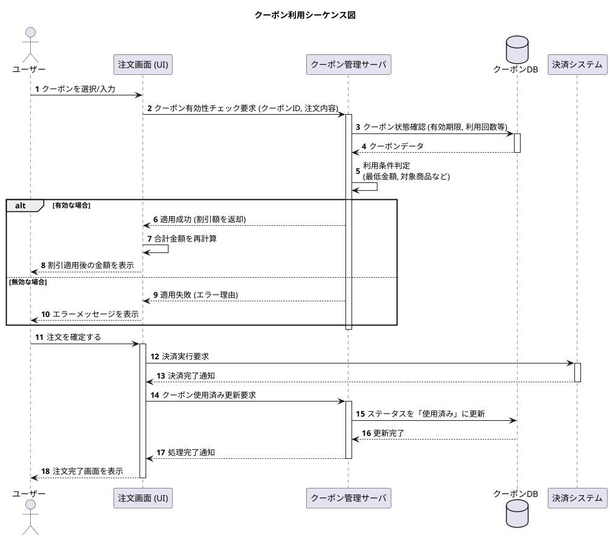
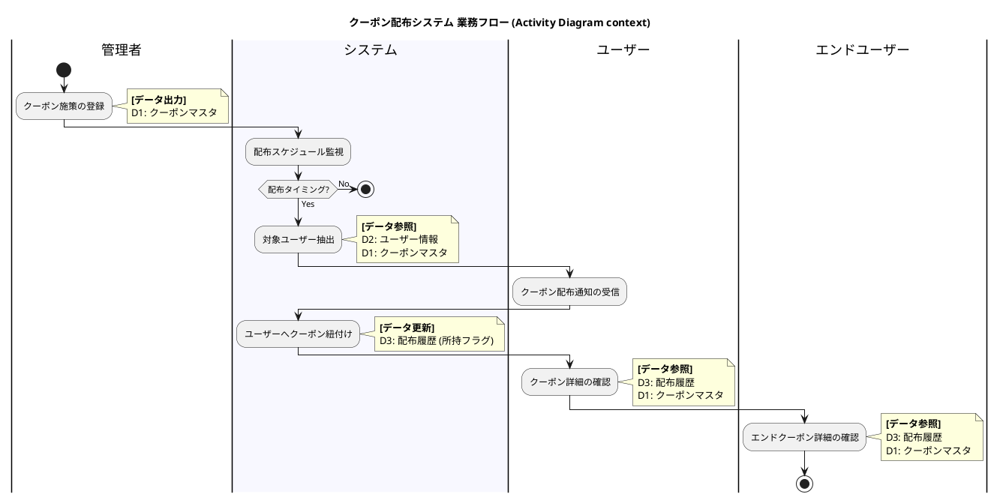
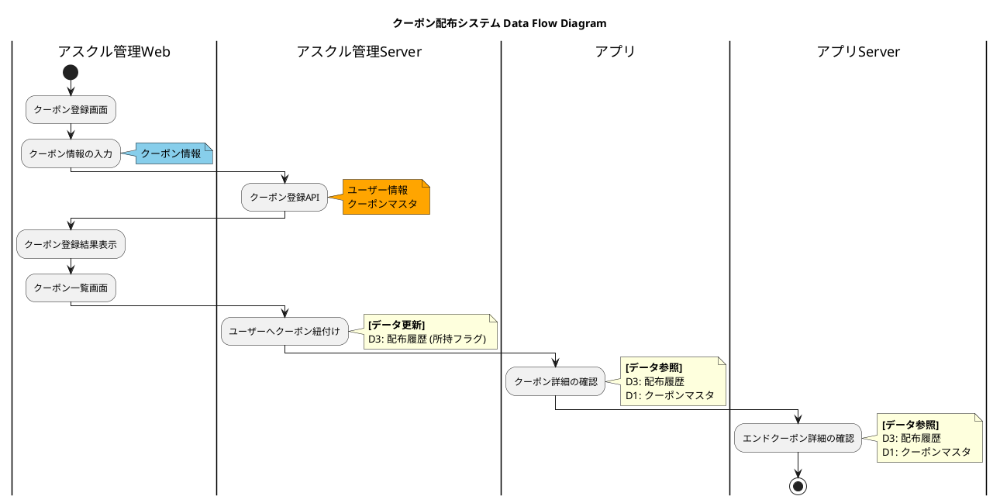

ユーザーがクーポンを使う際の手順(シーケンス図)」をPlantUMLで出力して

```plantuml
@startuml
title クーポン利用シーケンス図

actor ユーザー as user
participant "注文画面 (UI)" as ui
participant "クーポン管理サーバ" as server
database "クーポンDB" as db
participant "決済システム" as payment

autonumber

user -> ui : クーポンを選択/入力
ui -> server : クーポン有効性チェック要求 (クーポンID, 注文内容)
activate server

server -> db : クーポン状態確認 (有効期限, 利用回数等)
activate db
db --> server : クーポンデータ
deactivate db

server -> server : 利用条件判定\n(最低金額, 対象商品など)

alt 有効な場合
    server --> ui : 適用成功 (割引額を返却)
    ui -> ui : 合計金額を再計算
    ui --> user : 割引適用後の金額を表示
else 無効な場合
    server --> ui : 適用失敗 (エラー理由)
    ui --> user : エラーメッセージを表示
end
deactivate server

user -> ui : 注文を確定する
activate ui
ui -> payment : 決済実行要求
activate payment
payment --> ui : 決済完了通知
deactivate payment

ui -> server : クーポン使用済み更新要求
activate server
server -> db : ステータスを「使用済み」に更新
db --> server : 更新完了
server --> ui : 処理完了通知
deactivate server

ui --> user : 注文完了画面を表示
deactivate ui

@endum
```

クーポン配布システムのDFDをPlantUMLのアクティビティ図で出力して

```plantuml
@startuml
title クーポン配布システム 業務フロー (Activity Diagram context)


|管理者|
start
:クーポン施策の登録;
note right
  **[データ出力]**
  D1: クーポンマスタ
end note


|#GhostWhite|システム|
:配布スケジュール監視;
if (配布タイミング?) then (Yes)
  :対象ユーザー抽出;
  note right
    **[データ参照]**
    D2: ユーザー情報
    D1: クーポンマスタ
  end note
  
  |ユーザー|
  :クーポン配布通知の受信;

  |システム|  
  :ユーザーへクーポン紐付け;
  note right
    **[データ更新]**
    D3: 配布履歴 (所持フラグ)
  end note
else (No)
  stop
endif

|ユーザー|
:クーポン詳細の確認;
note right
  **[データ参照]**
  D3: 配布履歴
  D1: クーポンマスタ
end note

|エンドユーザー|
:エンドクーポン詳細の確認;
note right
  **[データ参照]**
  D3: 配布履歴
  D1: クーポンマスタ
end note

stop
@enduml
```

```plantuml

@startuml クーポン配布システム

title クーポン配布システム Data Flow Diagram

|アスクル管理Web|
start
:クーポン登録画面;
:クーポン情報の入力;
note right #skyblue
  クーポン情報
end note

|アスクル管理Server|
    :クーポン登録API;
    note right #orange
    ユーザー情報
    クーポンマスタ
  end note
  
  |アスクル管理Web|
  :クーポン登録結果表示;

  :クーポン一覧画面;

  |アスクル管理Server|  
  :ユーザーへクーポン紐付け;
  note right
    **[データ更新]**
    D3: 配布履歴 (所持フラグ)
  end note

|アプリ|
:クーポン詳細の確認;
note right
  **[データ参照]**
  D3: 配布履歴
  D1: クーポンマスタ
end note

|アプリServer|
:エンドクーポン詳細の確認;
note right
  **[データ参照]**
  D3: 配布履歴
  D1: クーポンマスタ
end note

stop
@enduml
```
