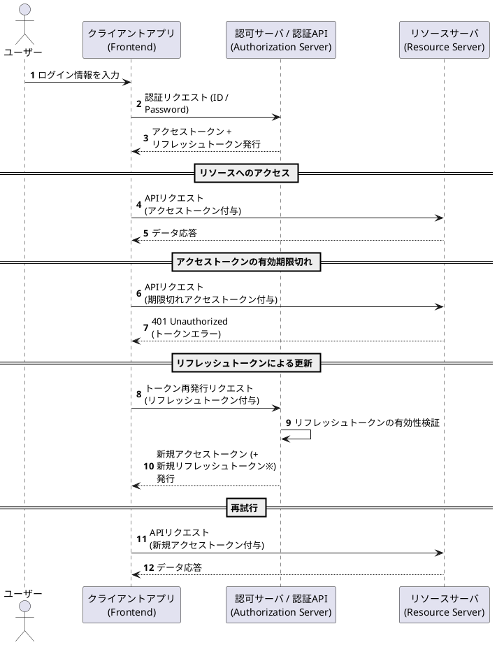

```plantuml
@startuml
autonumber
skinparam maxmessagesize 150

actor ユーザー as User
participant "クライアントアプリ\n(Frontend)" as Client
participant "認可サーバ / 認証API\n(Authorization Server)" as AuthServer
participant "リソースサーバ\n(Resource Server)" as ResourceServer

box "【初期認証】" #LightCyan
User -> Client: ログイン情報を入力
Client -> AuthServer: 認証リクエスト (ID / Password)
AuthServer --> Client: アクセストークン + リフレッシュトークン発行
end box

== リソースへのアクセス ==
Client -> ResourceServer: APIリクエスト (アクセストークン付与)
ResourceServer --> Client: データ応答

== アクセストークンの有効期限切れ ==
Client -> ResourceServer: APIリクエスト (期限切れアクセストークン付与)
ResourceServer --> Client: 401 Unauthorized (トークンエラー)

== リフレッシュトークンによる更新 ==
Client -> AuthServer: トークン再発行リクエスト (リフレッシュトークン付与)
AuthServer -> AuthServer: リフレッシュトークンの有効性検証
AuthServer --> Client: 新規アクセストークン (+ 新規リフレッシュトークン※) 発行

== 再試行 ==
Client -> ResourceServer: APIリクエスト (新規アクセストークン付与)
ResourceServer --> Client: データ応答
@enduml
```
